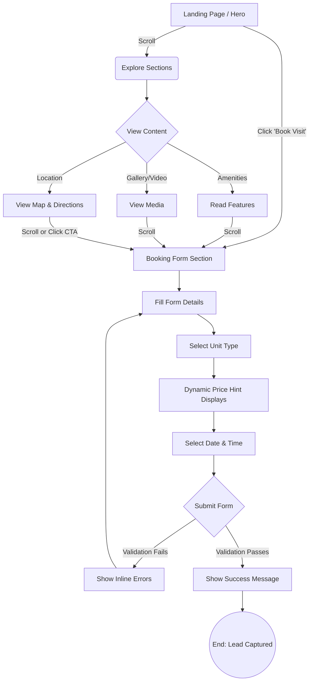

# User Flow Diagram

This diagram illustrates the user's journey from landing on the page to successfully booking a site visit.

```mermaid
graph TD
    A[Landing Page / Hero] -->|Scroll| B(Explore Sections)
    A -->|Click 'Book Visit'| F[Booking Form Section]
    
    B --> C{View Content}
    C -->|Amenities| D[Read Features]
    C -->|Gallery/Video| E[View Media]
    C -->|Location| G[View Map & Directions]
    
    D -->|Scroll| F
    E -->|Scroll| F
    G -->|Scroll or Click CTA| F
    
    F --> H[Fill Form Details]
    H --> I[Select Unit Type]
    I --> J[Dynamic Price Hint Displays]
    J --> K[Select Date & Time]
    K --> L{Submit Form}
    
    L -->|Validation Fails| M[Show Inline Errors]
    M --> H
    
    L -->|Validation Passes| N[Show Success Message]
    N --> O((End: Lead Captured))
```
